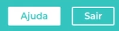

# Anotações gerais: 

1. Dentro do arquivo GlobalStyles é onde será feito o reset da página, lá também podemos colocar cores no :root, segue um exemplo:

```
// GlobalStyle.js

export import { createGLobalStyle } from 'styled-components'

const GlobalStyle = createGlobalStyle`
*{
    box-sizing: border-box;
    padding: 0;
    margin: 0;
    text-decoration: none;
}

`
```

Para usá-lo,  insira-o como primeiro component dentro do App.js fechando a tag nele mesmo, sem encapsular os próximos componentes.

Para usar as fontes do google por exemplo, é recomendado que seja indexado no próprio index.html da aplicação.

<br>

<h2 align="center">Utilizando variáveis</h2><br>
Dentro de components, crie uma pasta chamada UI, depois variaveis.js<br>

```
export const corPrimaria = "#41d3be"
export const fundoClaro = "#f1f1f1"
export const textoFundoClaro = "grey"
```
<br>

Para usar a cor: 

```
//Componente titulo

import { corPrimaria } from "./UI/variaveis"

const Titulo = styled.h1`

background-color: ${ corPrimaria }
`

```

<h2 align="center">Utilizando props</h2>

Agora começa a ficar interessante, para usarmos componentes reutilizáveis, e não ficar criando botões que mudam apenas o background, podemos passar propriedades para um botão só:

```
Cont Button = styled.a`

background: ${(props) => (props.primary ? "white" : corPrimaria)};
color: ${(props) => (props.primary ? corPrimaria : "white")};
`
```
Vale ressaltar que, em background, o valor default é corPrimaria (azul), e a color default é branca, caso não passe a propriedade para o componente ele retornará um botão branco com fundo azul. 

Para ver a diferença, use no botão: 

```
<Button primary > Ajuda </Button>

<Button> Sair </Button>
```

Resultado: <br><br>
<br>

Caso queira usar componentes em diversos lugares da aplicação, é uma boa prática escrevê-los dentro da pasta UI, criando um index.js para exportar os componentes estilizados, como ícones e imagens, porém vale lembrar que, será um componente, ou seja, a imagem em si, deve permanecer dentro de assets/img: 

<br>

```
import styled from "styled-components"

const Icone = styled.img`

width="40px";
height="40px"; 

`
```

<h2 align="center">Exportando uma função que pega dados de uma API</h2>

```
const Extrato = () => {

    return(
        <Box>
            {
            estrato.Lista.updates.map(({id,type,from, value, date}) => {
                return(
                     <div key="id">
                        <div>{type}</div>
                        <div>{from}</div>
                    </div>
                    );
                });
            }
        </Box>
    )

}

```

<h2 align="center">Passando props para os componentes filhos</h2><br><br>

```

// extrato.js -> esse arquivo que passa as props para o Itens

const Extrato = () => {
    return(
        <Box>
            {
            estrato.Lista.updates.map(({id,type,from, value, date}) => {
                return(
                     <Itens key={id} type={type} from={from} value={value}> date={date} />
                        
                    );
                });
            }
        </Box>
    )
}


/*Esse props são as propriedades que o pai (Extrato passou para o filho)*/


//arquivo Itens.js

import { Item } form "../Item"

const Items = styled.div`
    display:flex;
    align-items:center;
    justify-content:center;
`
export default (props) => {

    return <Itens>
             <Item {...props}/>
             <span >{props.date}</span>
           </Itens>
}


// arquivo Item.js

const Item = styled.div`
    display:flex;
    flex-direction: column;
`;

export default ({type, from, value}) => {
    return(
        <Item>
            <span>{type}</span>
            <span>{from}</span>
            <span>{value}</span>
        </Item>
    )
}


```


<h2 align="center">Criando uma função para mandar as imagens</h2>

Esse recurso, possibilita deixar um código mais limpo, já que todas as imagens que estão dentro da pasta assets/img/ serão importadas em um arquivo js dentro da pasta UI, chamado 
imageFilter.js<br><br>
Veja abaixo como fazê-lo:

```
//imageFilter.js

import alimentacao from "../assets/images/alimentacao.png"
import saude from "../assets/images/saude.png"
import transporte from "../assets/images/transporte.png"
import utilidades from "../assets/images/utilidades.png"
import default from "../assets/images/default.svg"
import {icone} from "../Component/UI"

export default (type) => {
    const Images = {
         
         Restaurante: <Icone src={alimentacao} alt="restaurante"> />,
         Saude: <Icone src={saude} alt="saude"> />,
         Transporte: <Icone src={transporte} alt="transporte"> />,
         Utilidades: <Icone src={utilidades} alt="utilidades"> />,
         Default: <Icone src={default} alt="default"
    }

    return Images[type] || Images.default;
}
```

<br>

Bom, aqui já temos o objeto <i>Images</i> pronto para ser usado, no caso, será usado em Itens:

```
//Itens.js

import ImageFilter from "../ImageFilter"

const Items = styled.div`
    display:flex;
    align-items:center;
    justify-content:center;
`
export default (props) => {

    return (<Itens>
            {ImageFilter(props.type)}
             <Item {...props}/>
             <span >{props.date}</span>
           </Itens>)
}

```


Só relembrando, neste exemplo, a API fake retorna o type como: 
- Restaurante 
- Saude
- Esporte
- etc 


Portanto, quando se faz um .map lá em extrato, o filho itens já recebe as propriedades, e pra cada type dela, vai retornar uma imagem com base no que falamos lá no ImageFilter.js
<br><br> Caso dê erro, cheque como a API retorna o dado, se for em letra minúscula, em ImageFilter.js deve-se colocar assim:<br>

```
// a api retorna um type="padaria"

export default (type){
    const Images = {
        padaria: ,
    }

    return Images[type]
}

```

<br><br>

<h2 align="center">Temas dark/light</h2>

Dentro da pasta UI em variavies.js

```
export const fundoClaro = "#f1f1f1";
export const conteudoClaro = "white";
export const textoFundoClaro = "grey"; 

export const fundoEscuro = "#363537";
export const textofundoEScuro = "#FAFAFA";
export const conteudoEscuro = "#5c5b5e";


```

Dentro de UI vamos criar um arquivo temas.js 

```
//temas.js


import {fundoClaro, ConteudoClaro, textoFundoClaro, fundoEscuro, textoFundoEscuro, conteudoEscuro} from "./variaveis"

export const temaClaro = {
    body: fundoClaro,
    inside: conteudoClaro,
    text: textoFundoClaro,
};

export const temaEscuro = {
    body: fundoEscuro,
    inside: conteudoEscuro,
    text: textoFundoEscuro,
}
```

Em App.js: 


```
import {ThemeProvider} from "styled-components"
import {temaClaro, temaEscuro} from "./Components/UI/temas"


function App() {

    return(
        <ThemeProvider theme={temaEscuro}>
            <GlobalStyle />
            <Conteudo />
        </ThemeProvider>
       
    )
}

```

Para usar o tema escuro, vá no componente e configure-o da seguinte forma:

```
const Titulo = styled.h1`
    color: ${({theme}) => {theme.text}};
`
```

<h2 align="center">Agora vamos mudar de tema a partir de um botão :)</h2>


Criar um botão dentro da pasta UI

```
export const BtnTema = styled.button`
position: absolute;
top: 4vh;
right: 20px;
background-color: inherit;
border: none;
cursor: pointer;
`
```

Agora, vamos criar um componente switch tema em components

```
// Components/switchTema/index.js

import ThemeOn from "../../assets/images/themeon.svg"
import ThemeOff from "../../assets/images/themeoff.svg"
impport { Icone } from "./UI"

const claro = <Icone src={ThemeOn} alt={Tema Claro}>
const escuro = <Icone src={ThemeOff} alt={Tema Escuro}>


export default ({tema}) => (tema ? escuro : claro))

```

<br>

Para usá-lo:

```
import { useState } from "react"
import SwitcherTema from "Components/SwitcherTema"

function App() {

    const [tema,setTema] = useState(true);
    
    const toggleTema = () => {
        setTema((tema) => !tema)
    }

    return(
        <ThemeProvider theme={tema ? temaClaro : temaEscuro}>
            <GlobalStyle />
            <BtnTema onCLick={toggleTema}}>
                <SwitcherTema tema = {tema}/>
            </BtnTema>
            <Conteudo />
        </ThemeProvider>
    )
}
```

<h2 align="center">Agora, falta mudar a cor dos ícones</h2>

```
arquivo UI/temas.js


export const TemaClaro = {
    filter: "",
}

export const TemaEscuro = {
    filter: "invert(100%)",
}


// No componente Icone


export const IconeTema = styled(Icone)`

filter: ${({theme}) => {theme.filter}};
`
```

Depois disso, vc deve mudar o Icone por IconeTema